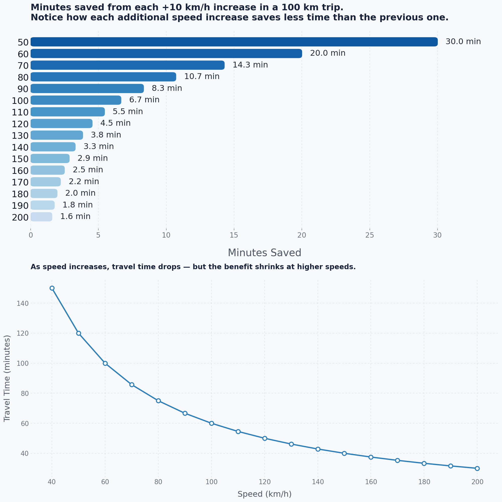
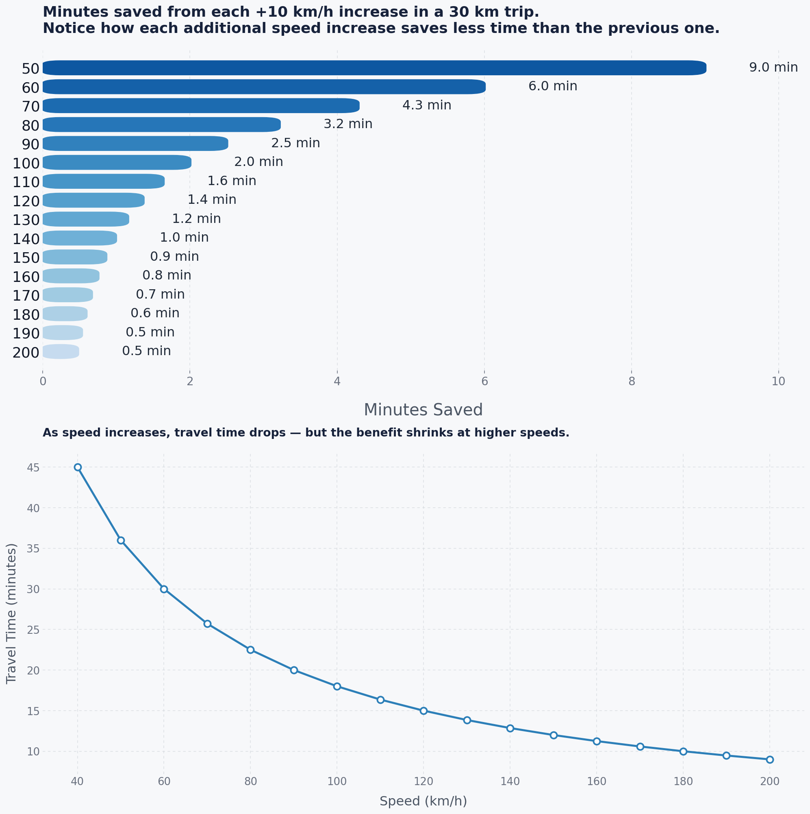

# 🚗 Is Speeding Actually Worth It?

*A simple data project inspired by a debate with my friend.*

## The Story

One day, my friend and I were talking about driving speeds.

His argument was simple:

> "Driving at 140 km/h instead of 120 km/h saves like 10 minutes. That's why I drive faster."

At first, it sounded reasonable. A higher speed should mean arriving much sooner, right?

But I started wondering:

* Does driving faster really save that much time?
* How much time do you actually save for every increase in speed?
* At what point do the benefits become negligible?
* Most importantly, is the time saved worth the additional risk?

So instead of guessing, I decided to do the math.

---

## What This Project Does

The project calculates travel times for different speeds and visualizes:

1. **Travel Time vs Speed**

   * How long a journey takes at different speeds.
   * Shows that travel time decreases rapidly at first, but the improvement slows down as speed increases.

2. **Minutes Saved Per +10 km/h Increase**

   * Measures the actual benefit of driving faster.
   * Reveals the concept of **diminishing returns**.

The analysis was performed for:

* 100 km trips
* 50 km trips
* 30 km trips

Because most daily journeys are much closer to 30–50 km than 100 km.

---

## Key Insight: Diminishing Returns

When you're driving slowly, increasing your speed makes a huge difference.

For example, on a 100 km trip:

| Speed Increase | Time Saved   |
| -------------- | ------------ |
| 50 → 60 km/h   | 30 minutes   |
| 60 → 70 km/h   | 20 minutes   |
| 70 → 80 km/h   | 14.3 minutes |

But once you're already driving fast:

| Speed Increase | Time Saved  |
| -------------- | ----------- |
| 120 → 130 km/h | 4.5 minutes |
| 130 → 140 km/h | 3.8 minutes |
| 140 → 150 km/h | 3.3 minutes |

The faster you already are, the less benefit each additional speed increase provides.

---

## The Reality Check

Most people aren't driving 100 km every day.

Let's look at a more realistic example: a **30 km journey**.

| Speed Increase | Time Saved  |
| -------------- | ----------- |
| 120 → 130 km/h | 1.4 minutes |
| 130 → 140 km/h | 1.2 minutes |
| 140 → 150 km/h | 1.0 minute  |

That means:

> Driving 20 km/h faster often saves only about **2–3 minutes** on a typical trip.

Not 10 minutes.

Not 15 minutes.

Just a couple of minutes.

---

## So... Is It Worth It?

That's the question this project made me think about.

To save those extra minutes, speeding often means:

* Less reaction time
* Longer stopping distances
* Higher accident severity
* Increased fuel consumption
* Greater chance of traffic fines

Meanwhile, the actual time saved may be only a minute or two.

The mathematics doesn't tell you how to drive.

It simply shows the trade-off more clearly.

---

## Example Output

The graphs below show:

### Travel Time vs Speed

A curve that drops quickly at lower speeds and then flattens out.

### Minutes Saved From Each +10 km/h Increase

A bar chart showing how every extra increase in speed provides less benefit than the previous one.

The visualizations make it clear that:

> The relationship between speed and time saved is not linear.

Going from 50 to 60 km/h is a big deal.

Going from 140 to 150 km/h is not.

---

## Conclusion

My friend wasn't completely wrong.

Driving faster **does** save time.

The surprising part is **how little time it saves once you're already driving at highway speeds.**

After running the numbers, the debate changed from:

> "I save so much time."

to

> "I'm taking extra risk to arrive a few minutes earlier."

And that's exactly why I built this project.

---

### Technologies Used

* Python
* NumPy
* Matplotlib
* Data Visualization

### Concepts Demonstrated

* Mathematical modeling
* Data visualization
* Diminishing returns
* Risk vs reward analysis
* Exploratory data analysis (EDA)

⭐ If this project made you rethink speeding, consider giving the repository a star.
